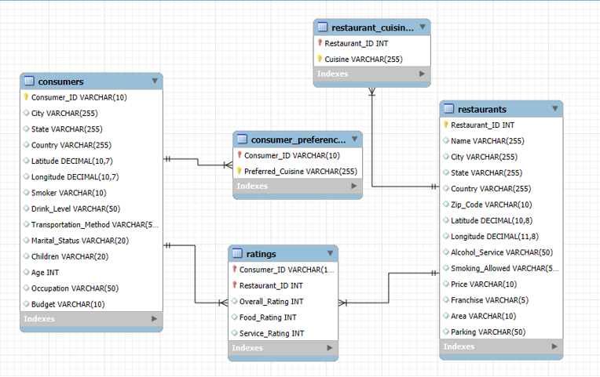

# 🍽️ Restaurant & Consumer Data Analysis Project (MySQL)

## 📌 Objective
The objective of this project is to analyze restaurant and consumer datasets to identify patterns in customer preferences, restaurant performance, and service quality. Using MySQL, the project applies data cleaning, joins, aggregations, subqueries, CTEs, views, and stored procedures to generate actionable insights.

---

## 📂 Dataset Overview
- **consumers.csv** – Consumer demographics (age, gender, city, occupation, budget, etc.)  
- **restaurants.csv** – Restaurant details (name, city, services, price range, parking)  
- **ratings.csv** – Consumer reviews (Overall Rating, Food Rating, Service Rating)  
- **consumer_preferences.csv** – Preferred cuisines per consumer  
- **restaurant_cuisines.csv** – Cuisines served by restaurants  
- **data_dictionary.csv** – Column descriptions  

---

## 🛠️ SQL Concepts Used
- Joins & Subqueries  
- Aggregations (AVG, COUNT, GROUP BY)  
- Conditional Filtering (WHERE, HAVING)  
- CTEs (Common Table Expressions)  
- Views  
- Stored Procedures  
- Window Functions  

---

## ❓ Key Analysis Questions
- Which cuisines are most preferred by different age groups and occupations?  
- Which restaurants have the highest average ratings?  
- Do restaurants with parking receive better reviews than those without?  
- Which consumers are the most active reviewers?  
- Which cuisines (e.g., Mexican, Italian) perform best in terms of ratings?  

---

## 📊 Business Insights
- **Mexican cuisine** is the most popular among consumers aged 25–35.  
- **Medium-priced restaurants** with wine/beer tend to get higher ratings.  
- **Students and social drinkers** are highly engaged in giving reviews.  
- Restaurants with **parking availability** score better in service ratings.  
- Consumers with a **medium budget** often prefer **American cuisine**.  

---

## 📑 Files in Repository

- **`Phase-1.sql` → Database Setup**  
  - Create database (`CREATE DATABASE`)  
  - Create tables (`CREATE TABLE`)  
  - Import CSV data into tables (`LOAD DATA INFILE`)  
  - Basic checks (`SHOW TABLES`, `SELECT * FROM table_name;`)  

- **`Phase-2.sql` → SQL Queries (Basic + Advanced)**  
  - Filtering queries using `WHERE`  
  - Joins and subqueries  
  - Aggregations and grouping  
  - Common Table Expressions (CTEs)  
  - Views and Stored Procedures  
  - Window functions and ranking queries  

- **`ER_Diagram.png`** → ER diagram of the database.  
- **`Project_Presentation.pptx`** → Final presentation slides.  
- **`README.md`** → Project documentation.  

---

## 🧩 ER Diagram (Schema)
  

---

## 👩‍💻 Author
**Chandana**  
📊 Aspiring Data Analyst  
🔗 [LinkedIn Profile](https://www.linkedin.com/)  

---

⭐ If you found this project interesting, don’t forget to **star this repository**!
